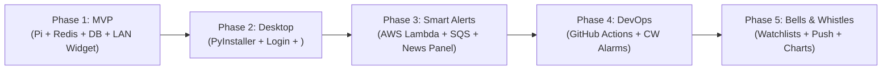

See the [Engineering Spec](stock-ticker-spec.md) for detailed component‑level information.

This document outlines the phased delivery plan for the Stock Ticker App, derived from the engineering specification in [WIP_stock-ticker-spec.md](file:///Users/melvindisla/Desktop/Repo/Stock-Ticker-App/WIP_stock-ticker-spec.md).

---

> **Note:** The full technology stack (FastAPI, Pydantic, httpx, asyncio, Redis‑py, SQLAlchemy, Docker, Docker‑Compose, etc.) is documented in the spec under **Section 3.1 – Technology Stack (Phase 1 – MVP)**.

## Phase 1: MVP — The Core Self-Hosted Ticker (v1.0)
>
> **Spec:** See the [Phase 1 – MVP](stock-ticker-spec.md#phase‑1‑mvp) section for detailed requirements.

> **Primary Milestone:** Reliable, persistent, containerized stock ticker running on Raspberry Pi 4 over LAN with **$0 cloud cost**.
> **Note:** The bootstrapping and hardening tasks are now part of Phase 1 and are performed by `scripts/hardening.sh`.

- [ ] **Raspberry Pi Hardware & Host OS Hardening:**
- **Technology Stack (Phase 1 – MVP):** FastAPI, Pydantic, httpx, asyncio, Redis‑py, SQLAlchemy, Docker, Docker‑Compose.
  - **Automated by `scripts/hardening.sh`:**
    - [✅] Verify NTP time synchronization (`systemd-timesyncd`).
    - [✅] Mount NVMe drive permanently at `/mnt/nvme` via `/etc/fstab`; enable weekly TRIM (`fstrim.timer`).
    - [✅] Verify NVMe UASP and TRIM support (`lsblk --discard`).
    - [✅] Configure host firewall (`ufw allow 22`, `ufw allow 8000` from LAN CIDR) and enforce SSH key authentication (`PasswordAuthentication no`).
    - [✅] Set strict `.env` file permissions on host (`chmod 600 .env`).
  - **Manual steps:**
    - [✅] Flash Raspberry Pi OS directly to NVMe SSD; update EEPROM bootloader to direct USB3 boot (`BOOT_ORDER=0xf41`) and remove microSD card entirely.
    - [✅] Verify official 15.3W USB-C power supply (run `vcgencmd get_throttled` to confirm `0x0` / no under-voltage).
    - [✅] Install active fan cooling or high‑mass aluminum heatsink case (target <65°C under load via `vcgencmd measure_temp`).
    - [ ] Create PostgreSQL storage directory on NVMe mount.
    - [ ] Connect via wifi and configure static DHCP reservation on home router.
    - [ ] Configure initial local database backup script (`pg_dump` compressed to `/mnt/nvme/backups/`).
- [ ] **Containerized Backend (`docker-compose.yml`):**
  - [ ] `api` service: FastAPI + Uvicorn server.
  - [ ] `redis` service: `redis:alpine` in-memory cache.
  - [ ] `postgres` service: `postgres:alpine` with data directory bind-mounted to NVMe.
- [ ] **Market Data & Caching Logic:**
  - [ ] Market data client adapter for primary provider.
  - [ ] Market-hours TTL cache policy in Redis (15–60s market hours, hours when closed).
  - [ ] Asynchronous write of history records to Postgres on live fetches.
- [ ] **Security & Networking:**
  - [ ] Shared API key header validation dependency on FastAPI routes.
  - [ ] LAN‑only Docker port publishing (no router port forwarding).
- [ ] Future: expose API publicly via reverse‑proxy (HTTPS) on port 443 when needed.

- [ ] **Basic Desktop Widget:**
  - [ ] Streamlit/Flask local UI wrapped in `pywebview` window.
  - [ ] Polling `GET /ticker/{symbol}` on interval with stale-data indicator fallback.
- [ ] **Observability & Diagnostics:**
  - [ ] Implement `GET /health` endpoint verifying Redis, Postgres, and NVMe disk headroom.
  - [ ] Structured JSON logging with `X-Correlation-ID` request tracking.
  - [ ] Docker container healthchecks and log rotation limits (`max-size="10m"`, `max-file="3"`).
- [ ] **Testing & Quality Assurance:**
  - [ ] **Unit Tests:** Mocked provider adapter HTTP responses (`respx`), in-memory Redis TTL calculations (`fakeredis`), and FastAPI route tests (`TestClient`).
  - [ ] **Integration Tests:** Run tests against real testcontainers (`redis:alpine`, `postgres:alpine`) verifying cache-then-fetch paths and Alembic up/down migrations.

---

## Phase 2: Native Desktop Experience & Remote Access (v1.1)
>
> **Spec:** See the [Phase 2 – Native Desktop Experience & Remote Access](stock-ticker-spec.md#phase‑2‑native‑desktop‑experience‑remote‑access)
>
> **Primary Milestone:** Widget feels like an OS-native application and is reachable securely from outside the home.

- [ ] **Standalone Packaging (PyInstaller):**
  - [ ] Windowed build for Windows (`.exe`) and macOS (`.app`) without console terminal.
  - [ ] Clean background thread shutdown when window closes.
- [ ] **Start at Login Integration:**
  - [ ] Windows: Registry entry in `HKEY_CURRENT_USER\Software\Microsoft\Windows\CurrentVersion\Run`.
  - [ ] macOS: User `LaunchAgent` plist loaded via `launchctl`.
  - [ ] First-run prompt asking user consent + settings toggle in widget UI.
- [ ] **Secure Remote Access ():**
  - [ ] Install and authenticate  on the Raspberry Pi.
  - [ ] Enable MagicDNS and automated Let's Encrypt HTTPS certificates.
  - [ ] Configure widget `.env` to target the Pi's  hostname.
- [ ] **Testing & Quality Assurance:**
  - [ ] **Unit Tests:** Mock OS registry (`winreg`) and filesystem plist calls to verify clean add/remove behavior without dangling entries.
  - [ ] **Packaging Smoke Tests:** Run packaged `.exe` and `.app` binaries in CI matrix with `--test` flag to verify webview libraries load without crashes.

---

## Phase 3: The "Smart" Alerting Slice (v2.0)
>
> **Primary Milestone:** Asynchronous AWS event-driven pipeline that sources and summarizes news on large price movements.

- [ ] **Price Delta Detection:**
  - [ ] Compare live price fetch against previous history record for symbol.
  - [ ] Asynchronously invoke AWS Lambda (`InvocationType: Event`) if delta exceeds threshold.
- [ ] **Narrow AWS Infrastructure (Terraform):**
  - [ ] AWS Lambda function running LangChain + Google News RSS feed parser + Cloud LLM.
  - [ ] SSM Parameter Store `SecureString` for LLM API key.
  - [ ] SQS Standard Queue + Dead-Letter Queue (DLQ) with redrive policy.
  - [ ] Least-privilege IAM execution role for AWS Lambda and IAM user/role for the Pi.
- [ ] **On-Demand SQS Polling on Pi:**
  - [ ] Ephemeral consumer task spawned strictly when AWS Lambda is dispatched (`WaitTimeSeconds=20`), scoped to that invocation's own `request_id`.
  - [ ] Non-matching messages (belonging to a different invocation) released via `ChangeMessageVisibility=0`, never deleted or ingested by the wrong poller.
  - [ ] Matching messages ingested to Postgres (`TickerNewsAlert`), then `DeleteMessage` called, and task terminates.
  - [ ] Clean timeout after 2–3 minutes if AWS Lambda fails.
  - [ ] FastAPI lifespan startup hook runs a full drain loop (not a single call) to recover any backlog produced during Pi downtime.
  - [ ] Low-frequency periodic backstop sweep (e.g. every 10–15 minutes) catches the residual case where a message arrives after every poller watching for it has already timed out.
- [ ] **Widget News Alert Panel:**
  - [ ] Decoupled polling loop for `GET /alerts?since={timestamp}` (30–60s).
  - [ ] Render news summary, symbol, price delta, and source links in dedicated alert section.
- [ ] **Testing & Quality Assurance:**
  - [ ] **Unit Tests:** Mock Google News RSS and Cloud LLM responses to verify LangChain prompt formatting and JSON output parsing.
  - [ ] **Unit Tests:** Mock SQS consumer with `moto` to verify idempotent upsert on duplicate delivery, `DeleteMessage` calls, timeout termination, non-matching-`request_id` release, drain-loop backlog recovery, and periodic sweep pickup.
  - [ ] **Integration Tests:** LocalStack / Moto server tests validating SQS long-polling, request-ID matching/release behavior, and DLQ redrive policies.
  - [ ] **Smoke Tests:** Post-deploy direct AWS Lambda invocation (`aws lambda invoke`) validating message arrival on SQS.

---

## Phase 4: Production-Grade DevOps & Observability (v2.5)
>
> **Spec:** See the [Phase 4 – DevOps & Observability](stock-ticker-spec.md#phase‑4‑devops‑observability) section
>
> **Primary Milestone:** Fully automated zero-touch deploys, log rotation, and proactive alarm notifications.

- [ ] **CI/CD Workflows (GitHub Actions):**
  - [ ] PR workflow (`ci.yml`): Automated linting (`ruff`), type checking (`mypy`), unit tests, testcontainer integration tests, and Terraform plan.
  - [ ] Deploy workflow (`deploy.yml`):
    - Multi-arch ARM64 Docker build pushed to GitHub Container Registry (`ghcr.io`).
    - Pi self-hosted runner executes `docker compose pull && docker compose up -d`.
    - Terraform apply for AWS Lambda/SQS via GitHub OIDC role.
- [ ] **Observability & Health:**
  - [ ] Docker log driver caps (`max-size="10m"`, `max-file="3"`).
  - [ ] CloudWatch Alarm on SQS `ApproximateAgeOfOldestMessage` (>15 mins).
- [ ] **Automated Backups & Disaster Recovery:**
  - [ ] Daily cron job running `pg_dump` of NVMe Postgres database with automated sync to off-host secondary storage (secondary drive or S3).
  - [ ] Document and test 10-minute rapid rebuild disaster recovery procedure from git repo, `.env`, and database backup.
- [ ] **Testing & Quality Assurance:**
  - [ ] Automated CI gate: Require 100% pass rate on unit & integration test suites before merge to `main`.
  - [ ] Post-deploy live health check verifying Pi `/ticker` endpoint returns HTTP 200.

---

## Phase 5: All the Bells and Whistles (v3.0+)
>
> **Spec:** See the [Phase 5 – Bells & Whistles](stock-ticker-spec.md#phase‑5‑bells‑whistles) section
>
> **Primary Milestone:** Multi-ticker tracking, real-time push streams, charting, and mobile notifications.

- [ ] **Watchlist Support:** Track and display multiple ticker symbols simultaneously with batch fetches.
- [ ] **Real-Time Push Delivery:** Migrate from client polling to Server-Sent Events (SSE) or WebSockets from the Pi API.
- [ ] **Charting & Technical Indicators:** Calculate moving averages (SMA/EMA) and RSI from Postgres history, rendered via interactive chart widgets.
- [ ] **Mobile Push Notifications:** Trigger `ntfy.sh` or Pushover webhooks on price-delta alerts to notify phone directly.
- [ ] **System Tray Companion (`pystray`):** Minimize widget to system tray / menu bar with status glance and show/hide toggle.
- [ ] **Pi Hardware & Service Dashboards:** Lightweight Prometheus + Grafana stack on the Pi monitoring container metrics and hardware thermals.
- [ ] **Testing & Quality Assurance:**
  - [ ] Stress/load test batch watchlist caching to ensure provider rate limits are never exceeded.
  - [ ] Integration tests for SSE/WebSocket connection lifecycles, reconnects, and push broadcasting.
