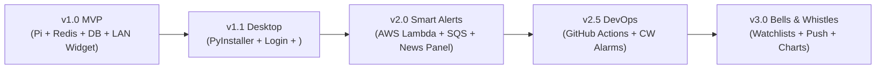

# Stock Ticker App — Engineering Spec


**Goals:** Prepare a fresh Raspberry Pi (NVMe boot via USB‑3, Wi‑Fi connectivity) with a hardened OS, required runtime tools, and secure secret handling infrastructure. No application code is deployed at this stage.

### Decisions & Requirements

- **Boot medium:** Direct USB‑3 boot from NVMe SSD (EEPROM set to `BOOT_ORDER=0xf41`). No micro‑SD card required.
- **Network:** Wi‑Fi only, configured via `wpa_supplicant`. No Ethernet.
- **Automation framework:** Ansible (agent‑less, SSH‑based) will manage all provisioning steps.
- **Secrets handling:** Runtime secrets (API keys, DB credentials, etc.) are delivered to the Pi via a GPG‑encrypted, SOPS‑encrypted payload embedded in the cloud‑init YAML; cloud‑init imports the one‑time GPG private key, decrypts the payload into a `.env` file (permissions `600`), then removes the key and encrypted blob.
- **Observability stack:** Deferred to Phase 4.

## 1. Overview

A system that serves near-real-time stock ticker data to a standalone desktop widget, backed by a containerized, self-hosted API running on a Raspberry Pi 4, with a persistent database stored on an NVMe drive. A narrow, event-driven AWS slice (AWS Lambda + SQS) supplements this: when a ticker moves by more than a configured threshold, a AWS Lambda function uses LangChain against a Google News backend to source and summarize relevant news for that symbol, which is ingested by the Pi and served via its API directly to the desktop widget UI. Primary constraint: **no ongoing cloud cost for the core backend**; the AWS Lambda/SQS/LLM slice is deliberately narrow and its costs are called out explicitly rather than assumed to be $0.

## 2. Goals / Non-Goals

### Goals

- Fetch ticker data (price, and optionally OHLC/volume) from a third-party provider.
- Cache responses to avoid redundant provider calls and stay within the provider's free-tier rate limit.
- Serve cached/fresh data through a containerized FastAPI service running on a Raspberry Pi 4.
- Persist historical ticker data in a durable database stored on an NVMe drive, accessed via an ORM.
- Run every server-side component (API, cache, database) as Docker containers, orchestrated with Docker Compose.
- Display data in a locally-run web-based UI (server runs on the user's Windows/macOS machine), presented as a standalone desktop widget — no browser tab, no visible address bar, launched by double-clicking an app.
- Runs identically on Windows and macOS with no platform-specific code paths (widget side); runs on Raspberry Pi OS / Debian ARM64 (server side).
- Detect large ticker price moves and trigger an AWS Lambda that uses LangChain + Google News to source and summarize relevant news for that symbol.
- Deliver the AWS Lambda's news summary back to the Pi securely (outbound-only pull via SQS, without ever exposing the Pi's API to the public internet), and have the Pi's API serve those news summaries to the desktop widget UI via a dedicated `GET /alerts` polling endpoint.
- Register the widget as a startup process on the user's machine (opt-in, toggleable), so it's running without the user needing to manually launch it after each login.

### Non-Goals (v1)

- No multi-tenant support — single user, single Pi, single widget (or a small number of widgets on your own devices).
- No historical charting or technical indicators (see Future Work).
- No production-grade SLA — hobby-scale reliability is acceptable; occasional Pi reboots/restarts are fine.
- No public internet exposure of the API — reachable only on the home LAN, or via a private mesh VPN (§4.4) if remote access is wanted. No open router port-forwarding. This constraint applies equally to the new AWS Lambda/SQS pipeline (§4.9) — it must not require an inbound path to the Pi either.
- No code-signing/notarization for the widget in v1 — may trigger an "unknown publisher" warning on first launch; acceptable for personal use.
- No high-availability/clustering for the Pi itself — a single Pi is a single point of failure, and that's an accepted tradeoff for a personal hobby project.
- No real-time/synchronous news delivery — the AWS Lambda pipeline (§4.9) is explicitly asynchronous; a delay of seconds to low minutes between a price move and the news summary appearing is acceptable.

## 3. Architecture

```text
[Widget window, Mac/Windows] --HTTPS (LAN or )--> [Raspberry Pi 4]
     (pywebview, packaged                                        |
      .exe/.app, holds an                              [Docker Compose stack]
      API key in local config)                                   |
                                                    +--------------+--------------+
                                                    |              |              |
                                              [api container] [redis]      [postgres]
                                              FastAPI+Uvicorn  (cache)   (persistent DB,
                                                    |                     volume on NVMe)
                                                    | large price delta detected
                                                    | (Pi → AWS, outbound only, SigV4-signed)
                                                    v
                                          [AWS Lambda: InvokeFunction]
                                                    |
                                    LangChain + Google News RSS + cloud LLM
                                                    |
                                          write result to [SQS queue]
                                                    |
                                    (Pi → AWS, outbound only, on-demand long-poll)
                                                    v
                                    [sqs-consumer, on-demand task in api container]
                                                    |
                                          write to Postgres (news/alert table)
```

Every arrow crossing the Pi/AWS boundary originates from the Pi — AWS Lambda never initiates a connection to the Pi. This preserves §4.4's LAN-only posture even with a real AWS component now in the architecture (§4.9). Furthermore, the Pi only polls SQS **on demand when the AWS Lambda is actually executed**, matched to that invocation's own `request_id` — plus a full drain on container startup and a low-frequency periodic backstop sweep (§4.9) — rather than running an infinite 24/7 polling loop. The loop closes back at the top: the widget polls the Pi's `GET /alerts` endpoint (§4.3) the same way it polls `GET /ticker/{symbol}`, which is how a news alert written to Postgres by the SQS consumer actually reaches the user — nothing here requires AWS to know the widget exists at all.

**Components:**

1. Provider API client (adapter module)
2. Cache layer — Redis, running as a container on the Pi
3. API service — FastAPI + Uvicorn, running as a container on the Pi (no AWS Lambda, no Mangum — this is now a normal long-running server process)
4. Access control & networking — API key auth, LAN-only by default, optional  for remote access (§4.4)
5. Persistent database + ORM — PostgreSQL (container, data volume on the NVMe drive) + SQLAlchemy
6. Containerization — Docker Compose orchestrating the above (§4.6)
7. Local web server on the widget side (Streamlit or Flask — unchanged in principle from before, now points at the Pi instead of a cloud endpoint), including polling both `/ticker` and `/alerts`
8. Widget shell — native window wrapping the local server, packaged as a standalone app (§4.8)
9. Price-move news alert — AWS Lambda (LangChain + Google News + cloud LLM) and SQS, invoked and consumed entirely from the Pi's side, with results served back out via the Pi's own API (§4.9)
10. Local server & hardware host — Raspberry Pi 4 + NVMe operational hardening and reliability configurations (§4.10)

## 4. Component Specs

### 4.1 Provider API Client

**Responsibility:** Abstract all provider-specific request/response details behind a stable interface, so the provider can be swapped without touching calling code. Unchanged from the original design — this layer never depended on AWS.

**Interface contract:**

- Input: ticker symbol (string, normalized to uppercase).
- Output: a normalized internal data shape (§5), regardless of provider's native response shape.
- Must raise/return a distinguishable error type for: invalid symbol, rate-limit exceeded, provider unreachable/timeout.

**Requirements:**

- Timeout on outbound HTTP calls (e.g. 5s) — never let a hung provider call hang a request.
- Log (or return) the provider's rate-limit headers if available, so callers can detect approaching limits.
- No retry-with-backoff inside this layer for v1 — a failed call is a failed call; handle fallback behavior at the orchestration layer (§4.3).

### 4.2 Cache Layer (Redis)

**Responsibility:** Store the normalized ticker data shape, keyed by symbol, with a TTL that reflects market state.

**Interface contract:**

- `get(symbol) -> data | not_found`
- `set(symbol, data, ttl_seconds) -> ack`

**Key schema:** `ticker:{SYMBOL}` — one key per symbol, storing the full normalized object.

**TTL policy (this is a decision, not a constant):**

| Market state | TTL |
| --- | --- |
| Regular trading hours | 15–60s |
| Pre/post-market | 60–120s |
| Market closed (weeknight/weekend) | Several hours |

Market-state determination can be a simple day-of-week + time-of-day check against exchange hours (ignore holidays for v1, or hardcode a holiday list — known gap).

**Why this still matters even without AWS billing:** the TTL policy's original purpose was twofold — avoid AWS cost, and stay under the provider's free-tier rate limit. The AWS half is gone now, but the provider rate limit is still real and still the actual constraint driving this table.

**Deployment:** Redis runs as its own container in the Compose stack (§4.6) — a standard `redis:alpine` image, no external SaaS (Upstash), no DynamoDB workaround. This is simpler than the AWS version of this spec in every respect: no pay-per-request pricing to reason about, no free-tier ceiling to watch. Redis's own persistence (RDB/AOF) is unnecessary here — this is a cache, not the source of truth, and is fine to lose on container restart.

### 4.3 API Service (FastAPI + Uvicorn)

**Responsibility:** The one place that implements the cache-then-fetch decision logic, exposed as a FastAPI application running as a normal long-lived server process (not a AWS Lambda-style per-invocation handler).

**Logic:**

1. FastAPI/Pydantic validates the symbol from the path parameter (`GET /ticker/{symbol}`). Malformed input is rejected (400) before touching cache or provider.
2. Check the optional in-process cache (module-level dict with TTL) for a fresh entry. If present → return it (200), tag `source: cache` — no network call at all. This is genuinely more valuable now than it was on AWS Lambda, since the API process stays warm indefinitely rather than only for the lifetime of a reused execution environment.
3. Otherwise, query Redis for `ticker:{SYMBOL}`.
4. If present and not expired → return it (200), tag `source: cache`, populate the in-process cache.
5. If absent/expired → call the provider client.
   - On success: write to Redis with the TTL from the current market-state policy, populate the in-process cache, write a record to the persistent history table (§4.7, off the response's critical path — a background task, not a blocking call), return fresh data (200), tag `source: live`.
   - **Price-delta check (also off the critical path):** compare the newly-fetched price against the most recent history record for this symbol. If the absolute or percentage change exceeds a configured threshold, asynchronously invoke the price-move news AWS Lambda (§4.9) — fire-and-forget from the response's perspective, so a slow LLM/news pipeline downstream never adds latency to a ticker request. Concurrently launch an in-process on-demand SQS polling task (§4.9), scoped to this invocation's own `request_id`, to await and ingest that specific invocation's alert without risk of consuming a different invocation's message.
   - On provider failure: serve stale Redis data if available (tag `source: stale-fallback`), or return an error (502/503) if none exists. Deliberate choice, documented in code, not an accident of exception handling.
6. All responses share one JSON shape (§5) regardless of source.

**`GET /alerts` — the route that actually delivers AWS Lambda-sourced news back to the widget:**

- Query params: `symbol` (optional — filter to one ticker), `since` (optional ISO 8601 timestamp — only alerts newer than this), `limit` (optional, default a modest number like 20, caps response size).
- Reads directly from Postgres' `TickerNewsAlert` table (§5) — no Redis/provider involvement, since this is just serving data the SQS consumer (§4.9) already wrote there. Ordered by `timestamp` descending.
- Same API-key auth as every other route (§4.4) — no separate access-control mechanism needed for this endpoint.
- Deliberately stateless from the API's side: there's no server-side "mark as read" concept. The widget tracks the newest `timestamp` it has already displayed and passes it back as `since` on the next poll — this keeps the API's contract simple (a pure filtered read) and avoids adding a mutation path and its own failure modes just to track read state.

**Non-functional requirements:**

- The process is long-running now (unlike AWS Lambda), so in-process state is a legitimate first-class cache layer rather than a best-effort optimization riding on uncertain container reuse — though Redis remains the source of truth for correctness, since the API container can still restart (deploys, crashes, `docker compose restart`).
- Run via `uvicorn` (optionally behind `gunicorn` with multiple Uvicorn workers if you want more than one process handling requests) — a Pi 4's 4 cores can comfortably run a couple of workers for a single-user app, though one worker is plenty at this traffic level.
- **On-demand SQS polling:** Rather than maintaining a wasteful 24/7 background polling loop, the API process spawns a targeted, bounded background task (via FastAPI `BackgroundTasks` or `asyncio.create_task`) strictly when a AWS Lambda invocation is dispatched (§4.9). This task long-polls SQS (`WaitTimeSeconds=20`) until a message matching its own `request_id` arrives or until a bounded timeout (e.g. 2–3 minutes); a non-matching message is released back to the queue immediately (`ChangeMessageVisibility=0`) rather than consumed, so one invocation's poller can never accidentally swallow another's alert. A FastAPI lifespan startup handler runs a full drain loop (not just one call) to process any backlog left on the queue while the container was offline, and a low-frequency periodic sweep (e.g. every 10–15 minutes) acts as a backstop for the narrow case where a message arrives after every poller watching for it has already timed out.

### 4.4 Access Control & Networking

**Default posture**: **LAN‑only** (API only reachable on the LAN).  # Future: expose via reverse‑proxy (HTTPS) when public access is needed.

**Authentication: API key header.** Since there's no AWS IAM available in a self-hosted setup, the natural (and now primary, not just a "lighter alternative") mechanism is a shared-secret header checked by a FastAPI dependency on every route:

- Generate a random, sufficiently long key once; store it as an environment variable passed into the `api` container (via the Compose file's `env_file`, not hardcoded).
- The widget stores the same key in its local `.env` (§4.5) and sends it as a header on every request.
- This is meaningfully simpler than the AWS SigV4 story from the cloud-hosted version of this spec — no credential chains, no SDK signing, just a string comparison — and it's an appropriate level of rigor for a service that's LAN-only by default in the first place.

**Remote access (if you ever want the widget to reach the Pi from outside your home network):**

- **Recommended: .** A free-for-personal-use private mesh VPN — install the  client on the Pi and on whichever machine runs the widget, and they can reach each other over a private, encrypted tunnel without any router port-forwarding or public exposure at all. This is the closest spiritual equivalent to the earlier IAM-based "only me" guarantee: strong, identity-based access control, still genuinely free.
- also offers free HTTPS certificates for its private domains (MagicDNS + Let's Encrypt integration), which is worth using if you want encryption in transit even though it's already a private tunnel — cheap to set up, no reason to skip it.
- Explicitly avoid router port-forwarding to the Pi as an alternative to  — it reintroduces public exposure for a service that was designed from the ground up to avoid it.

**Resource limits (the Pi-native equivalent of AWS Lambda's Reserved Concurrency):** set `mem_limit`/`cpus` constraints on the `api` and `postgres` services in the Compose file. There's no per-invocation billing risk to cap anymore, but a runaway container (e.g. a bug causing a request storm) could still starve the Pi's other containers of resources — a loose cap is cheap insurance.

### 4.5 Local Web-Based UI (cross-platform: Windows + macOS)

**Responsibility:** Serve a browser-accessible page, running as a local process on the user's machine, that polls the Pi's API endpoints on an interval and renders the result — both live ticker data (`GET /ticker/{symbol}`) and, now, news alerts (`GET /alerts`, §4.3).

**Framework choice:** Streamlit or Flask, both cross-platform-safe by construction (browser-rendered, not an OS-native GUI toolkit).

**Configuration:**

- The widget's `.env` now holds the Pi's address (LAN IP/hostname, or  hostname if using remote access) and the API key from §4.4 — a flat string, considerably simpler than the AWS credential-chain question from the cloud-hosted version of this spec.
- If the Pi's LAN IP can change (DHCP), prefer a stable hostname — either a static DHCP reservation on your router for the Pi, or 's MagicDNS name, so the widget's config doesn't break after a router reboot.

**Requirements (ticker polling):**

- Polling interval configurable, defaulting to something equal to or longer than the shortest cache TTL (§4.2).
- On request failure: display the last successfully fetched value with a staleness indicator rather than a blank/error state, unless failures persist beyond a threshold.
- Display the `source` field from the response for debugging.

**Requirements (alerts polling — a separate, independent poll loop):**

- Poll `GET /alerts?since={last_seen_timestamp}` on its own interval, decoupled from the ticker poll interval — alerts are inherently less frequent than price updates, so tying the two together would mean either polling alerts unnecessarily often or delaying ticker updates for no reason. A longer interval (e.g. 30–60s) is appropriate here.
- Track the newest alert `timestamp` seen client-side (in the widget's own local state — no server-side "read" tracking, per §4.3) and pass it as `since` on each subsequent poll, so the Pi only ever returns genuinely new alerts.
- Render new alerts in a dedicated panel/section of the widget's page (symbol, summary, timestamp, source links) — appended to what's already displayed, not replacing it, so a user briefly glancing away doesn't miss an alert that arrived and then scrolled off.
- A failed alerts poll should fail silently from the user's perspective (log it, retry next interval) rather than surfacing an error state — missing a news update for one cycle is a minor, self-correcting problem, unlike a failed ticker poll where staleness genuinely matters more.

### 4.6 Containerization (Docker Compose)

**Responsibility:** Package and orchestrate every server-side component as containers, so the whole backend deploys and updates as one coherent unit rather than a hand-assembled set of processes on the Pi.

**Services in the Compose stack:**

| Service | Image | Notes |
| --- | --- | --- |
| `api` | Custom, built from a `Dockerfile` in the repo | FastAPI + Uvicorn (§4.3). Multi-arch build required — see §10. |
| `redis` | Official `redis:alpine` | Cache layer (§4.2). No persistent volume needed — cache loss on restart is fine. |
| `postgres` | Official `postgres:alpine` (or similar) | Persistent database (§4.7). Data directory bind-mounted to a path on the NVMe drive. |

**NVMe storage for the database — the concrete requirement behind "save the database on the NVMe drive":**

- Mount the NVMe drive at a fixed path on the Pi's filesystem (e.g. `/mnt/nvme`), and bind-mount a subdirectory of it into the `postgres` container as its data directory, rather than using a plain Docker named volume (which would default onto the Pi's boot SD card unless explicitly redirected). This is the actual mechanism that gets the database's bytes physically onto the NVMe drive rather than just conceptually "using" it.
- Benefit beyond raw speed: keeping database I/O off the boot SD card materially reduces SD card wear, which matters for a Pi's typical long-term reliability — the original project note about being on a 32GB SD card, plus an NVMe addition specifically for the database, suggests this reliability concern is already part of the thinking here.
- Set the NVMe mount to persist across reboots via the Pi's `/etc/fstab`, not just mounted ad hoc — otherwise a reboot could bring the Pi up with the database directory missing, which Postgres would treat as "first run" rather than "here's your existing data."

**Cross-cutting container practices:**

- `restart: unless-stopped` on every service — the Pi-native equivalent of AWS Lambda automatically retrying; if a container crashes or the Pi reboots, Docker brings everything back without manual intervention.
- Docker `healthcheck` directives on `api` and `postgres` — lets Docker (and `docker compose ps`) report real health status, and lets `restart: unless-stopped` actually detect and recover a hung-but-not-crashed container, not just a fully dead one.
- `.env` file (git-ignored) for secrets (API key, DB credentials) referenced by the Compose file via `env_file:` — never baked into the images themselves.
- Docker's log driver configured with explicit `max-size`/`max-file` limits (§12's logging note) so container logs don't silently fill the SD card/NVMe over months of uptime.

### 4.7 Persistent Database & ORM

**Recommended: SQLAlchemy + PostgreSQL.** Every AWS-hosted-relational-database compromise from the cloud-hosted version of this spec (RDS's 12-month trial, Aurora Serverless's idle floor, SQLite-on-S3's near-zero-but-not-quite cost, DynamoDB's no-joins constraint) simply doesn't apply once the database is a container on hardware you already own — there's no cloud billing to reason about, so this is a much less constrained decision than it used to be.

- **SQLAlchemy** is the standard Python ORM, first-class documented alongside FastAPI, and gives genuine relational querying — joins, aggregations, window functions for moving averages — which is a real advantage for backtesting-style analysis over the DynamoDB path this spec previously had to consider under AWS-cost constraints.
- Use **Alembic** (SQLAlchemy's standard migration tool) for schema migrations from day one — trivial to add now, painful to retrofit once the history table has real data in it.
- No more AWS Lambda-specific connection-pooling concern (the RDS Proxy problem from the AWS version) — the API is a long-running process now, so a normal SQLAlchemy connection pool (a handful of persistent connections) behaves exactly as SQLAlchemy expects, with no serverless-specific workaround needed.

**Lighter alternative: SQLite on the NVMe drive**, if Postgres feels like more moving parts than a single-user hobby app needs. SQLAlchemy supports both dialects with largely the same code, so this is a low-cost decision to defer or revisit — start with whichever feels right, the ORM layer insulates you from most of the switching cost later. SQLite's concurrent-write limitations are a non-issue here regardless of choice, since this is a single API process talking to its own database.

**Data model:** the `TickerHistoryRecord` shape from §5, mapped to a SQLAlchemy model with `symbol` and `timestamp` as an indexed (and likely composite-unique) pair, mirroring the partition/sort-key design intent from the DynamoDB version of this spec, now expressed as a normal relational index.

### 4.8 Widget Shell (standalone packaging)

**Responsibility:** Turn the local web UI (§4.5) into a native-feeling desktop widget — unchanged in principle from the original design.

**(a) Removing browser chrome:** `pywebview`, pointed at `http://127.0.0.1:{port}` (the widget's own local server, which in turn talks to the Pi). Widget-specific window properties: fixed small size, optional `on_top=True`, optional `frameless=True`.

**(b) Standalone executable:** PyInstaller, built separately per OS (no cross-compilation) — a `.exe` on Windows, a `.app` on macOS, "windowed"/"no console" mode. Bundle or prompt for the Pi's address and API key on first launch.

**Requirements:**

- Single double-click launch.
- Closing the widget window cleanly terminates the background server thread — no orphaned process.
- Window size genuinely widget-sized, not a full browser-window default.

**(c) Start at login — registering as a startup process:**

This is inherently platform-specific (there's no cross-platform API for "run this on login"), so handle it explicitly per OS rather than assuming one mechanism covers both:

| Platform | Mechanism | Why this one |
| --- | --- | --- |
| Windows | A value in `HKEY_CURRENT_USER\Software\Microsoft\Windows\CurrentVersion\Run`, pointing at the packaged `.exe` | Per-user (`HKCU`), needs no admin rights, and is a single registry write/delete via Python's built-in `winreg` — no extra dependency, no `.lnk` shortcut file to construct. Shows up in Task Manager's Startup tab like any other startup entry, so the user can always see and disable it outside the app too. |
| macOS | A `LaunchAgent` plist in `~/Library/LaunchAgents/`, loaded via `launchctl` | Per-user, no admin rights, the standard mechanism for a login item that isn't a full native `.app` bundle with Login Items integration. Avoids AppleScript/`osascript`-based approaches, which can trigger additional automation permission prompts on newer macOS. |

**Behavior:**

- Offer this as a choice on first launch (e.g. a checkbox: "Start automatically when I log in"), rather than silently registering it — the widget is already asking the user to trust it with an API key and Pi address on first run, and startup registration is a further step that deserves the same explicit consent rather than being bundled in as an assumed default.
- Surface the same toggle inside the widget's own UI afterward (a small settings checkbox on the existing local page, §4.5 — no need for a system tray icon just for this single toggle) so the user can turn it on or off later without needing to know where the registry key or LaunchAgent plist lives.
- Registering/unregistering is symmetric: the same code path that writes the `Run` key or installs+loads the LaunchAgent should also know how to remove/unload it, so toggling the setting off actually cleans up rather than leaving an orphaned entry pointing at a since-deleted or since-moved executable.

**Requirements (extending the list above):**

- On first launch, the user is asked whether to enable start-at-login, and their choice is respected without any further OS-level setup on their part.
- The toggle in the widget's settings accurately reflects and controls the real OS-level registration state — never a UI checkbox that's disconnected from whether the entry actually exists.
- Uninstalling/removing the widget (or toggling the setting off) removes the startup entry cleanly on both platforms — no dangling registry key or LaunchAgent plist left behind.

### 4.9 Price-Move News Alert (AWS Lambda + LangChain + SQS)

**Responsibility:** When a ticker moves by more than a configured threshold, source and summarize relevant news for that symbol using LangChain against a Google News backend and a cloud-hosted LLM, and get the result back to the Pi — all without ever requiring an inbound connection to the Pi.

**This is the section that answers "cloud best practices for the AWS Lambda to communicate with the API on the Pi."** The core design principle: **every cross-boundary connection is initiated by the Pi, never by AWS.** The Pi already has a well-established, narrowly-scoped pattern for reaching out to AWS (this spec used exactly that shape earlier for the cloud-hosted version's IAM auth); the same principle extends cleanly here, just applied to a different pair of AWS services.

**Direction 1 — Pi invokes the AWS Lambda:**

- Triggered by the price-delta check in §4.3. The Pi holds a narrowly-scoped IAM credential (an IAM user or role, same least-privilege posture used throughout this spec) granted **only** `lambda:InvokeFunction` on this specific function's ARN — nothing broader.
- Invoke **asynchronously** (`InvocationType: Event`) rather than synchronously — the Pi's ticker-serving path must never block on AWS Lambda/LangChain/LLM latency, which can easily run several seconds. The invocation payload carries the symbol, the price delta, and a timestamp; nothing else needs to cross this boundary.
- This direction is a straightforward, well-worn pattern — outbound HTTPS from the Pi to a public AWS API endpoint, SigV4-signed. No different in kind from the credential handling already documented earlier in this spec for the cloud-hosted architecture.

**Inside the AWS Lambda:**

- **LangChain** orchestrates the pipeline: a retriever/tool wrapping a news source, feeding results to a cloud-hosted LLM (per the project's existing preference for a cloud LLM over a locally-run model) to produce a concise summary of why the symbol might be moving.
- **Google News backend, free option:** Google News doesn't have an official free API. The practical, no-API-key approach is Google News' public RSS search feed (`news.google.com/rss/search?q={symbol}`), which is freely parseable and fits this project's cost-conscious pattern. A paid provider (e.g. SerpApi's Google News endpoint) exists if you want more structured/reliable results later, but isn't necessary for v1 and isn't free — flagged here explicitly rather than assumed.
- **The LLM call is the one genuinely non-free piece of this entire spec.** Unlike every other AWS service used so far (AWS Lambda, SQS, DynamoDB, S3 at hobby scale), cloud LLM APIs don't have an indefinite free tier at any real usage. Be upfront about this rather than folding it into the "$0" framing that's applied everywhere else — pick a provider with a usable free/low-cost tier for hobby-scale usage, and treat this line item as the one real recurring cost in the whole system.
- The LLM API key is a secret the AWS Lambda needs at runtime. Store it in **SSM Parameter Store as a `SecureString`** (not Secrets Manager — Parameter Store's standard tier is free, Secrets Manager bills per secret per month), referenced by the AWS Lambda's environment configuration and decrypted at cold start. The AWS Lambda's execution role needs least-privilege `ssm:GetParameter` on that one parameter's ARN, plus `kms:Decrypt` on the key used to encrypt it if a customer-managed KMS key is used (the AWS-managed default key also works and needs no extra IAM grant).

**Direction 2 — AWS Lambda's result reaches the Pi via SQS, not a direct call back:**

- The AWS Lambda writes its result (symbol, summary, source article links, timestamp) as a message to a dedicated **SQS standard queue**. The AWS Lambda's execution role needs least-privilege `sqs:SendMessage` on that one queue's ARN.
- **On-demand polling (only when AWS Lambda is executed):** The Pi's `api` container runs a pull-based consumer (§4.3), but **polls SQS strictly on demand rather than as a 24/7 continuous daemon**:
  - **Trigger:** When the Pi invokes the AWS Lambda asynchronously, it generates a unique `request_id` (UUID) in the payload and immediately launches an ephemeral in-process polling task dedicated to retrieving the alert.
  - **Long-polling:** The task calls `ReceiveMessage` with `WaitTimeSeconds=20` (max long-poll). Because the AWS Lambda typically finishes in 5–15 seconds, the message is almost always collected on the very first or second poll.
  - **Request-ID matching (closes a message-orphaning gap):** because this is a standard, non-FIFO queue, a poller can receive *any* message currently on the queue — not necessarily the one from the invocation that spawned it. A poller must check the received message's `request_id` against the one it's actually waiting for:
    - **Match:** validate, upsert into Postgres, call `DeleteMessage`, and cleanly terminate — same as before.
    - **No match:** immediately call `ChangeMessageVisibility` with `VisibilityTimeout=0` so the message becomes visible to other pollers again right away (rather than holding it hostage for the remainder of its default visibility timeout, or — worse — deleting someone else's alert). The poller then continues its own long-poll loop within its own bounded timeout, still waiting for its own `request_id`.
    - This matters because the earlier version of this design had every poller process-and-delete whatever it received, regardless of which invocation it belonged to. In practice this mostly self-healed, but it had a real failure mode: if a fast poller grabbed a slow invocation's *eventual* message before that invocation's own poller had a chance to, and every currently-running poller happened to exit (successfully, on a different message) before the slow one's message arrived, that message could end up with zero active listeners — sitting in the queue with no automatic recovery until an unrelated future invocation happened to sweep it up, or the container restarted. Matching by `request_id` and releasing non-matches back to the queue immediately (rather than consuming them) prevents a poller from ever "stealing" another invocation's message in the first place.
  - **Bounded Timeout:** If the AWS Lambda errors or times out before publishing to SQS, the poller times out after a bounded limit (e.g., 2–3 minutes / ~6–9 long polls), logs a failure warning, and exits. It never hangs or polls in an infinite loop.
  - **Startup Recovery Drain:** On API container startup (via FastAPI lifespan event), a long-poll drain loop runs — repeatedly calling `ReceiveMessage` until the queue reports empty (or a sane cap on iterations is hit), not just a single call — to catch any messages that accumulated while the Pi or container was offline, including possibly more than one.
  - **Periodic backstop sweep (the second half of closing the gap):** even with request-ID matching, a message can still end up orphaned in one narrow case — every poller that was watching for it happens to time out and exit *just before* it arrives (e.g. an unusually slow LLM response outlasting the 2–3 minute window). Request-ID matching prevents another poller from mistakenly consuming it, but nothing else is left watching for it either. A lightweight sweep — a single bounded `ReceiveMessage` drain, run on a low-frequency schedule (e.g. every 10–15 minutes, independent of whether any invocation is currently in flight) — catches this residual case. This is not a return to the old 24/7 20-second loop: at a 15-minute interval this adds roughly 2,900 requests/month, still a small fraction of SQS's free tier, and still overwhelmingly cheaper than continuous long-polling, while closing the last gap the on-demand design otherwise leaves open.
  - **Zero waste (revised):** on-demand invocation-triggered polling plus a periodic backstop sweep together still eliminate the vast majority of the ~130,000 empty polling calls/month a continuous loop would generate — the exact monthly total now depends on invocation volume plus the sweep's fixed cadence, but stays comfortably within SQS's free tier at any realistic hobby usage, while no longer leaving a silent-failure window.
- The Pi's consumer credential needs least-privilege `sqs:ReceiveMessage`, `sqs:DeleteMessage`, `sqs:ChangeMessageVisibility`, and `sqs:GetQueueUrl` on that one queue's ARN — a second narrow grant alongside the `lambda:InvokeFunction` grant from Direction 1, not a combined broad policy.
- **Idempotency:** SQS is at-least-once delivery, so the Pi's consumer must handle a duplicate message safely — upsert keyed by a AWS Lambda-generated request ID (included in the message body) rather than a blind insert, so a redelivered message doesn't create a duplicate news-alert row.
- **Dead-letter queue:** configure a redrive policy sending messages to a DLQ after a small number of failed receive attempts (e.g. 3–5). Worth being precise about what this does and doesn't catch: it triggers on a message being *received* repeatedly without being deleted, not on a message that's simply never received at all — so the DLQ is a safety net for a message that's actively being mishandled, while the periodic sweep above is what catches a message nobody has looked at yet. The two mechanisms are complementary, not redundant.
- Message retention on the queue should comfortably exceed the Pi's expected worst-case downtime (a few days is reasonable for a personal device) so a Pi outage doesn't lose alerts outright, just delays them.

**Data model:** a `TickerNewsAlert` shape, persisted to Postgres by the consumer — see the addition in §5. This table is the entire handoff point to the rest of the system: the widget never talks to AWS Lambda, SQS, or AWS at all — it only ever sees this data via the Pi's own `GET /alerts` endpoint (§4.3), which is what actually gets the news in front of the user.

**Architectural Decision: Why SQS vs. Direct Synchronous Invocation:**

- **The Inbound Problem:** The Pi is behind a home NAT router without port forwarding. AWS Lambda in AWS cannot call the Pi directly. SQS allows the Pi to initiate an **outbound-only** connection to retrieve messages, preserving the LAN-only posture.
- **Downtime Buffering:** If the Pi reboots, loses home Wi-Fi, or experiences a power outage while the AWS Lambda is executing, SQS safely buffers the alert message for days. Direct synchronous invocation without a queue would lose the alert if the network drops during the 15-second LLM execution.
- **Latency Isolation:** LLM summarization takes 5–20s. Asynchronous dispatch + SQS decouples this delay so the Pi returns ticker data to the user immediately.
- **Alternative (Direct Synchronous Background Task):** If a user explicitly wants to eliminate AWS SQS and Terraform queue resources entirely, the Pi could invoke the AWS Lambda synchronously in an in-process background thread (`InvocationType: RequestResponse`) and receive the payload directly in the return body. This simplifies cloud infrastructure at the cost of losing alerts if the local network drops during execution.

### 4.10 Local Server & Hardware Operations (Raspberry Pi 4 + NVMe)

**Responsibility:** Specify the physical host, storage, power, networking, and system-level configurations required to run a reliable 24/7 self-hosted homelab backend on a Raspberry Pi 4.

#### 1. Power Supply & Under-Voltage Protection

- **Dedicated 15W Supply:** The Raspberry Pi 4 with an attached NVMe SSD (over USB 3.0 or PCIe HAT) requires substantial peak power. Generic phone chargers cause subtle voltage sags that result in silent CPU throttling and transient USB/NVMe disconnects.
- **Requirement:** Must use the official Raspberry Pi 15.3W USB-C Power Supply (5.1V / 3.0A).
- **Diagnostics:** Periodically monitor for under-voltage flags using `vcgencmd get_throttled` (a value of `0x0` indicates healthy power delivery; bit 0 indicates under-voltage detected).
- **Power Cut Protection:** Enable PostgreSQL `fsync=on` (default) to ensure write-ahead log (WAL) integrity on sudden power loss. For high availability, connect the Pi and home router to an inexpensive mini 5V/12V DC-UPS.

#### 2. Thermal Management & Cooling

- Under sustained Docker container loads and database maintenance, an uncooled Pi 4 quickly exceeds 80°C, triggering thermal throttling down to 1.0 GHz or 750 MHz.
- **Requirement:** Active fan cooling or a high-mass passive aluminum heatsink case (e.g. Argon ONE, FLIRC, or an Ice Tower) maintaining CPU thermals below 65°C under load (`vcgencmd measure_temp`).

#### 3. Storage Architecture: Ditching the SD Card (Direct NVMe Boot)

- **Problem:** MicroSD cards degrade rapidly under continuous Docker container layer churn, swap operations, and system logging, leading to silent filesystem corruption.
- **Architecture Decision:** Update the Pi 4 EEPROM bootloader to **boot directly from the NVMe SSD over USB3** (`BOOT_ORDER=0xf41`). Remove the microSD card entirely.
  - Increases disk I/O throughput from ~30 MB/s (Class 10 SD) to ~350+ MB/s (USB 3.0 UASP NVMe).
  - Hosts both the root OS filesystem and the Docker storage driver (`/var/lib/docker`) on enterprise-grade NAND flash.
- **SSD Health & TRIM:** Verify USB adapter supports UASP and TRIM (`lsblk --discard`). Enable a weekly cron job (`sudo fstrim -av`) to prevent write performance degradation over time.

#### 4. Local Networking & IP Stability

- **Static DHCP Reservation:** Home routers assign dynamic IP addresses via DHCP that change on router reboot or lease expiry, which would break the desktop widget's target address.
  - Configure a **Static DHCP Reservation** in the home router mapping the Pi’s MAC address to a fixed local IP (e.g. `192.168.1.150`), OR
  - Rely exclusively on  MagicDNS (`http://raspberrypi.tailnet.ts.net:8000`), which remains stable across physical networks.
- **Wi‑Fi Preferred:** Connect the Pi to the local router via Wi‑Fi (2.4GHz/5GHz) – this is the default connectivity method. Ensure a stable SSID and a strong signal; the static DHCP reservation (or MagicDNS) will keep the address stable.

#### 5. System Clock & NTP (The "RTC" Limitation)

- **The Gotcha:** Raspberry Pi boards lack an onboard battery-backed Real-Time Clock (RTC). If powered on without immediate internet, the system clock can reset to 1970 or the last shutdown timestamp.
- **Impact on Cloud Calls:** AWS SigV4 request signatures and HTTPS TLS certificates strictly reject requests if the client clock skew exceeds 5 minutes (`RequestTimeTooSkewed`).
- **Mitigation:** Ensure `systemd-timesyncd` or `chrony` is enabled to synchronize time immediately via NTP upon network link acquisition prior to launching Docker containers.

#### 6. Local Host Security & Secrets Hygiene

- **Firewall (`ufw`):** Enable local firewall on the Pi allowing only incoming port 22 (SSH) and port 8000 (FastAPI API) from the local subnet CIDR (e.g., `192.168.1.0/24`) and  interface (`tailscale0`).
- **SSH Hardening:** Disable password authentication in `/etc/ssh/sshd_config` (`PasswordAuthentication no`); enforce public key authentication only.
- **Host Secrets:** The `.env` file storing market provider keys, database credentials, and AWS access keys must have strict file permissions: `chmod 600 .env` (readable and writable only by the host deployment user).

#### 7. Disaster Recovery & Rapid Rebuild Plan

- **Database Dump Cron:** A daily cron job executes a compressed dump of the Postgres historical database:

  ```bash
  docker exec stock-postgres pg_dump -U stockuser stockdata | gzip > /mnt/nvme/backups/db_$(date +%F).sql.gz
  ```

- **Off-Host Backup:** Periodically sync the backup directory to a secondary USB drive or an S3 bucket.
- **10-Minute Rebuild:** Because the Compose file, Dockerfile, and Alembic migrations are version-controlled in Git, restoring to a replacement Pi requires only flashing a fresh Raspberry Pi OS image, cloning the repo, restoring `.env` and `db.sql.gz`, and running `docker compose up -d`.

## 5. Data Model

**Response/cache shape:**

```text
symbol: string
price: number
timestamp: string (ISO 8601, when this price was captured)
source: enum [cache, live, stale-fallback]
change: number (optional)
change_percent: number (optional)
```

**Persistent history shape** (§4.7), mapped via SQLAlchemy:

```text
id: integer (primary key)
symbol: string (indexed)
timestamp: datetime (indexed; composite index with symbol for range queries)
price: number
change: number (optional)
change_percent: number (optional)
```

Deliberately a separate shape from the response object — the history record's purpose (a permanent, queryable log) differs from the response shape's purpose (a transient point-in-time value).

**Ticker news alert shape** (§4.9), written by the Pi's SQS consumer, sourced from the AWS Lambda's output:

```text
id: integer (primary key)
request_id: string (unique — AWS Lambda-generated, used for idempotent upsert)
symbol: string (indexed)
price_delta_percent: number
summary: string (LLM-generated)
source_links: array of strings
timestamp: datetime
```

## 6. Error Handling Summary

| Failure point | Behavior |
| --- | --- |
| Invalid/unknown symbol | 400, no cache/provider call |
| Provider timeout/error, no cache available | 502/503 with clear error body |
| Provider timeout/error, stale cache available | Return stale data, tagged `stale-fallback` |
| Redis unreachable | Fall back to direct provider call (degrade, don't fail outright) |
| Postgres unreachable | History write fails silently (logged, non-blocking) — live ticker responses continue to work off Redis/provider alone |
| History table write failure | Log and continue — never fail or delay the response for a write that's off the critical path |
| API container crashed/restarting | `restart: unless-stopped` recovers it automatically; widget shows staleness indicator in the meantime |
| AWS Lambda invocation fails (throttled, error) | Logged on the Pi side; price-move alert is missed; on-demand SQS task does not spawn — never blocks or delays ticker response (§4.3) |
| Pi offline when AWS Lambda writes to SQS | Message sits in the queue (retention covers multi-day outages); startup recovery drain loop fetches and persists all backlogged messages on container boot (§4.9) |
| Duplicate SQS delivery | Consumer upserts by `request_id` — never creates a duplicate alert row (§4.9) |
| Poller receives a message for a different invocation | Visibility immediately reset (`ChangeMessageVisibility=0`) rather than deleted — released back to the queue for the correct poller (or the periodic sweep) to pick up (§4.9) |
| Message arrives after every poller watching for it has already timed out | Caught by the periodic backstop sweep (every 10–15 min) rather than left orphaned indefinitely (§4.9) |
| Google News/LLM call fails inside AWS Lambda | AWS Lambda logs failure and exits without writing to SQS; Pi's on-demand poller times out cleanly after bounded window (2–3 mins) and terminates |
| `GET /alerts` request fails (widget-side) | Fail silently, retry on next poll interval — never surface an error state for a missed alert cycle (§4.5) |
| UI request failure | Show last-known value + staleness indicator |

## 7. Cost Constraints (design implications)

- No AWS/cloud billing at all for the backend — the Pi, its NVMe drive, and electricity are the only real costs, and they're sunk/fixed regardless of usage. This is a stronger guarantee than the old "$0 within AWS free tier" framing, which always carried some risk of a free-tier ceiling being crossed.
- Electricity: a Pi 4 draws roughly 5–7W under typical load — worth acknowledging honestly as a real (if trivial, single-digit-dollars-per-year) cost, rather than claiming literal $0.
- (§4.4), if used for remote access, is free at personal-use device counts — verify current limits if the device count ever grows.
- Provider API calls remain the one real usage-sensitive constraint — the TTL policy (§4.2) exists to stay under the provider's free-tier rate limit, independent of anything AWS- or Pi-related.
- GitHub Actions minutes (§10) are the one remaining "free tier to watch," same as before — still generous at hobby scale.
- AWS Lambda invocations (§4.9) are genuinely low-volume by design — only on large price moves, not on every ticker request — and comfortably within AWS Lambda's always-free tier at any realistic hobby usage.
- SQS is Always Free up to 1M requests/month. Because the Pi polls SQS strictly on demand after triggering the AWS Lambda, plus a periodic backstop sweep every 10–15 minutes rather than a continuous 24/7 loop (§4.9), monthly SQS request volume drops from ~130,000 requests to roughly a few thousand (invocation-triggered polling plus ~2,900 sweep calls/month) — still well under 1% of the free tier, with no risk of runaway polling charges, and without the message-orphaning gap a purely invocation-triggered design would otherwise leave open.
- SSM Parameter Store's standard tier (used for the LLM API key, §4.9) is free; Secrets Manager was deliberately avoided here for that reason.
- **The LLM API itself is the one real recurring cost in this entire system.** Every other component in this spec — Pi hardware (sunk), Redis/Postgres (self-hosted), AWS Lambda/SQS/SSM (free-tier), GitHub Actions (free-tier) — has a genuine path to $0 or near-$0. Cloud LLM usage does not, once free credits or a free tier's usage cap is exceeded. Size the price-move threshold (§4.3) with this in mind — a looser threshold means fewer AWS Lambda/LLM invocations and lower cost, not just less noise.

## 8. Acceptance Criteria (v1)

- [ ] Given a valid symbol with no cache entry, the system fetches from the provider, caches it in Redis, and returns it.
- [ ] Given a valid symbol with a live Redis entry, the system returns cached data without calling the provider.
- [ ] Given a valid symbol with an expired Redis entry, the system re-fetches and re-caches.
- [ ] TTL varies correctly based on market hours vs. closed.
- [ ] Provider failure with available stale cache returns stale data, not an error.
- [ ] Provider failure with no cache returns a clear error, not a crash/timeout.
- [ ] A malformed symbol is rejected by FastAPI/Pydantic validation with a 400.
- [ ] Every live fetch writes a corresponding record to Postgres, without delaying or failing the response if that write fails.
- [ ] History records are queryable by symbol, ordered by timestamp, using the indexed columns (no full-table scan).
- [ ] `docker compose up` from a clean checkout brings up all three services (api, redis, postgres) successfully.
- [ ] The Postgres data directory is confirmed to live on the NVMe mount, not the boot SD card, after a fresh `docker compose up`.
- [ ] Killing the `api` container causes Docker to restart it automatically within a reasonable interval, with no manual intervention.
- [ ] A request without the correct API key header is rejected (401/403) before touching cache, provider, or database.
- [ ] The API's port is confirmed unreachable from outside the home network (no router port-forward in place).
- [ ] UI displays last-known value on a failed poll rather than going blank.
- [ ] Widget installs and runs via the same commands (venv setup + single entry point) on both Windows and macOS.
- [ ] Packaged widget launches via a single double-click on both platforms, with no visible terminal/console window.
- [ ] A merge to main triggers a multi-arch (ARM64) image build and a deploy to the Pi, without manual steps.
- [ ] A price move exceeding the configured threshold triggers an asynchronous AWS Lambda invocation without adding latency to the ticker response itself.
- [ ] A price move below the threshold does not trigger a AWS Lambda invocation.
- [ ] The AWS Lambda successfully retrieves news for a test symbol via the Google News RSS feed and produces an LLM-generated summary.
- [ ] The AWS Lambda's result appears in Postgres via the Pi's on-demand SQS consumer task within a reasonable delay, with no inbound connection ever required to the Pi.
- [ ] The Pi performs zero SQS `ReceiveMessage` calls during steady-state idle operation, initiating polling strictly upon triggering a AWS Lambda invocation.
- [ ] If a AWS Lambda invocation produces a message while the Pi's `api` container is stopped, restarting the container causes the startup recovery drain to ingest the alert into Postgres — including when more than one message accumulated during the downtime.
- [ ] Simulated concurrent invocations: when a poller receives a message whose `request_id` doesn't match its own, it releases the message back to the queue (visibility reset, not deleted) rather than consuming it — confirmed the "wrong" poller neither ingests nor discards another invocation's alert.
- [ ] A message that arrives after every poller watching for it has already timed out is still eventually ingested, via the periodic backstop sweep, without requiring a container restart.
- [ ] A duplicate SQS delivery (simulated by not deleting a message after processing) does not create a duplicate alert row.
- [ ] The Pi's IAM credential is confirmed to have only the two narrow grants described in §4.9 (`lambda:InvokeFunction` on one ARN, `sqs:Receive/Delete/GetQueueUrl` on one ARN) — no broader AWS permissions.
- [ ] After a news alert lands in Postgres (via the SQS consumer), the widget's next `GET /alerts` poll retrieves it and displays it without requiring a restart or manual refresh.
- [ ] Calling `GET /alerts?since={timestamp}` returns only alerts newer than that timestamp — confirmed with a mix of older and newer test records.
- [ ] A `GET /alerts` call with no matching new alerts returns an empty result cleanly, not an error.
- [ ] End-to-end: a simulated large price move results in a news alert visibly appearing in the widget, with no manual intervention anywhere in the pipeline (price detection → AWS Lambda → SQS → Postgres → `/alerts` → widget).
- [ ] On first launch, the user is prompted to enable start-at-login; choosing yes creates a real, working startup entry on both Windows and macOS.
- [ ] With start-at-login enabled, a full OS logout/login (or reboot) results in the widget launching automatically with no manual action.
- [ ] Toggling start-at-login off via the widget's own settings removes the startup entry, confirmed via Task Manager's Startup tab (Windows) or `~/Library/LaunchAgents` (macOS) — no orphaned entry remains.

## 9. Testing Strategy

A multi-tiered testing strategy ensures each component can be verified quickly and in isolation without incurring third-party provider costs or cloud charges, complemented by integration and smoke tests.

### 9.1 Test Scope & Pyramid

```text
              ┌────────────────────────┐
              │   Smoke & Live E2E     │  Post-deploy health checks, AWS Lambda test
              │                        │  events, packaged executable checks
              ├────────────────────────┤
              │   Integration Tests    │  FastAPI + real Redis & Postgres testcontainers,
              │                        │  Alembic up/down migrations, SQS long-poll
              ├────────────────────────┤
              │       Unit Tests       │  Mocked provider HTTP, fakeredis, mock boto3/moto,
              │                        │  FastAPI TestClient, Pydantic validation
              └────────────────────────┘
```

#### 1. Unit Testing (Isolated, Fast, Zero Cloud/Provider Cost)

- **Provider API Client (§4.1):**
  - Mock outbound HTTP responses using `respx` or `aioresponses`.
  - Verify payload parsing and normalization into the internal data model (§5).
  - Verify distinct exception mapping: invalid symbol (400/404), provider rate limits (429), server errors (500/503), and HTTP timeouts (5s threshold).

- **Cache Layer Logic (§4.2):**
  - Simulated in-memory Redis via `fakeredis`.
  - Validate market-hours TTL calculation: open (15–60s), closed (several hours), pre/post-market (60–120s).
  - Validate cache key formation (`ticker:{SYMBOL}`) and TTL assignment.
- **API Service & Routing (§4.3):**
  - Tested using Starlette/HTTPX `TestClient`.
  - **Authentication:** Verify requests without or with invalid `X-API-Key` headers return 401/403 before touching cache or provider.
  - **Input Validation:** Verify malformed symbols (numbers, excessive length, special chars) are rejected with 400.
  - **Cache-Fetch Logic:** Verify cache hit returns 200 with `source: cache`; cache miss calls provider, updates cache, and returns `source: live`.
  - **Fallback Stale Response:** Verify provider failure serves stale Redis data tagged `source: stale-fallback` when present; returns 502/503 when empty.
  - **Price Delta Math:** Verify threshold check accurately identifies price movements exceeding the configured delta and triggers asynchronous AWS Lambda dispatch.
- **On-Demand SQS Worker (§4.3, §4.9):**
  - Mock AWS interactions via `moto` or `pytest-mock`.
  - Test worker long-polling lifecycle: polls SQS, ingests a matching-`request_id` message, calls `DeleteMessage`, and exits.
  - Test bounded timeout: poller cleanly shuts down after 2–3 minutes without hanging if AWS Lambda fails to publish.
  - Test idempotency: duplicate deliveries of the same `request_id` update existing Postgres records rather than inserting duplicate rows.
  - Test non-matching `request_id`: a message belonging to a different invocation is released via `ChangeMessageVisibility=0`, not deleted or ingested, and the poller continues waiting for its own message.
  - Test startup drain loop: multiple backlogged messages are all fetched and persisted, not just the first one.
  - Test periodic backstop sweep: a message with no active poller watching for it is still picked up on the next scheduled sweep.
- **AWS Lambda & LangChain News Pipeline (§4.9):**
  - Mock Google News RSS search feed XML responses and Cloud LLM completions.
  - Test prompt templates and LangChain output parsing into structured summary and source URL array.
  - Test SSM Parameter Store decryption mock for LLM API key loading.
- **Desktop Widget UI & Packaging Logic (§4.5, §4.8):**
  - Test polling state machines: decoupled intervals for `/ticker` and `/alerts`, client-side `since` timestamp tracking.
  - Test error states: last-known price displayed with staleness indicator when API is unreachable.
  - Test OS startup integration: mock `winreg` (Windows) and `plistlib`/filesystem (macOS) to verify clean registration and unregistration.

#### 2. Integration Testing (Real Component & Service Interactions)

- **API + Redis + PostgreSQL Stack (`testcontainers-python` or ephemeral Docker Compose):**
  - Spin up isolated `redis:alpine` and `postgres:alpine` test containers.
  - Verify real Redis read/write/expiration behavior and connection pool reuse.
  - Verify live fetches write history records to PostgreSQL asynchronously without degrading HTTP response latency.
  - Verify indexed composite queries on `(symbol, timestamp)` execute as index scans without full-table scans.

- **Database Schema Migrations (Alembic):**
  - Automated migration test executing `alembic upgrade head` followed by `alembic downgrade base` against a test database to confirm non-destructive, reversible migrations.
- **Local SQS Integration (Moto Server / LocalStack):**
  - Test the on-demand SQS consumer against a local queue with real long-polling and DLQ redrive policies.

#### 3. Smoke & Deployment Verification Tests

- **Pi Container Stack Health:**
  - Post-deploy automated curl command hitting `GET /ticker/{symbol}` and `GET /alerts` with the configured API key to confirm container stack is up and responding.

- **AWS Lambda Pipeline Smoke Test:**
  - Post-deploy direct AWS Lambda invocation (`aws lambda invoke`) with test symbol payload to verify execution succeeds and a test message appears on SQS.
- **Desktop Packaging Smoke Test:**
  - In CI matrix runners (`windows-latest`, `macos-latest`), run PyInstaller output with `--test` or `--version` flag to verify executables bundle without missing shared libraries or dynamic link errors.

### 9.2 Tooling Summary

| Layer | Tools | Purpose |
| --- | --- | --- |
| Test Runner | `pytest`, `pytest-asyncio` | Async test execution and fixtures |
| HTTP Mocking | `respx`, `httpx` | Mocking provider HTTP calls |
| Redis Mocking | `fakeredis` | In-memory Redis simulation |
| AWS Mocking | `moto`, `botocore.stub` | SQS and AWS Lambda invocation simulation |
| Containerized Infra | `testcontainers-python` | Ephemeral Redis & Postgres for integration tests |
| Migrations | `alembic` | Up/down migration verification |
| Code Quality | `ruff`, `mypy` | Fast linting, formatting, and static typing |

## 10. CI/CD Pipeline

**Platform: GitHub Actions**, covering two genuinely different deploy targets now — the Pi (container image) and AWS (AWS Lambda code + the narrow Terraform-managed slice in §11).

**Workflow files:**

- `.github/workflows/ci.yml` — every push/PR: lint, unit tests (mocking Redis/Postgres/provider/SQS so tests need no real infra), integration tests against testcontainers, `docker build` sanity check, AWS Lambda unit tests (mocking the LangChain/news/LLM calls), `terraform plan` for the AWS slice (§11).
- `.github/workflows/deploy.yml` — push to `main`: build the multi-arch API image, push it to a registry, deploy to the Pi; separately, package and deploy the AWS Lambda's code and `terraform apply` the AWS slice.
- `.github/workflows/release.yml` — version tag: matrix widget build (`windows-latest` + `macos-latest`), unchanged from before.

**The ARM64 build problem (Pi image only — the AWS Lambda build is unaffected, standard x86_64):**

- GitHub's standard hosted runners are x86_64. A Pi 4 is ARM64. Building an ARM64-compatible image on an x86_64 runner requires cross-compilation via Docker Buildx with QEMU emulation (`docker/setup-qemu-action` + `docker/setup-buildx-action` + `docker/build-push-action` with `platforms: linux/arm64`) — the standard, free approach, though emulated builds are noticeably slower than native ones.
- Push the built image to **GitHub Container Registry (ghcr.io)** — free at hobby scale, already authenticated via the workflow's built-in `GITHUB_TOKEN`, no separate registry account needed.
- The AWS Lambda's deployment package, by contrast, needs no cross-compilation — AWS Lambda's Python runtime is x86_64 or arm64 by your own choice of AWS Lambda architecture setting, independent of what hardware CI runs on; a standard hosted runner builds and zips it (or builds a container image for the AWS Lambda, if the LangChain/dependency footprint favors that over a zip package) without QEMU involved.

**Deploying to the Pi — two viable approaches, pick one deliberately:**

| Approach | How it works | Tradeoff |
| --- | --- | --- |
| Self-hosted GitHub Actions runner, installed on the Pi itself | The final deploy job actually executes on the Pi (registered as a self-hosted runner), so `docker compose pull && docker compose up -d` runs locally with no network hop needed | Cleanest, most idiomatic for a fixed personal device; the Pi needs to stay reachable to GitHub to pick up jobs |
| SSH deploy from a GitHub-hosted runner | A hosted runner SSHs into the Pi (key stored as a repo secret) and runs the same pull/up commands remotely | No runner software to maintain on the Pi; requires the Pi's SSH port to be reachable from GitHub's runner IPs, which pushes against the LAN-only posture in §4.4 unless done over |

Given §4.4's LAN-only default, the **self-hosted runner on the Pi** is the better fit — it never requires opening any inbound path to the Pi from the internet; the Pi reaches out to GitHub, not the other way around. Note this same runner can also be the one that applies the Pi-side IAM credential's rotation if that's ever automated, since it already runs in a trusted location.

**Deploying the AWS Lambda + AWS slice — a standard, OIDC-authenticated GitHub-hosted runner job (no ARM64/Pi-specific concerns):**

- `terraform apply` (§10) reconciles the AWS Lambda function, SQS queue, IAM roles/policies, and SSM parameter definition (not its value — see §10) against the merged config.
- Update the AWS Lambda's code (via Terraform's AWS Lambda resource pointing at the newly-built package, or a separate `aws lambda update-function-code` step, matching whichever pattern the Terraform AWS Lambda resource expects).
- Smoke test: invoke the AWS Lambda directly with a test payload and confirm a message lands on the SQS queue — a more targeted check than the Pi-side smoke test, since this pipeline has its own failure surface.

**Best practices carried over from the AWS version, still applicable:**

- Separate validate (PR) from deploy (merge) — a PR should never trigger a real deploy, for either target.
- Secrets (API key, DB credentials, SSH key if that path is chosen, LLM API key's *value* — see §11) live in GitHub Actions secrets, never committed.
- Pin action versions and the base image tags in the Dockerfile, so a working pipeline doesn't silently break from an upstream update.
- OIDC for the AWS-side deploy job, exactly as recommended earlier in this spec's history for the cloud-hosted architecture — no long-lived AWS access keys in GitHub secrets, a scoped role assumed per-run instead.
- Smoke test after deploy — a real request to the Pi's `/ticker/{symbol}` endpoint (through the self-hosted runner, which already has LAN access) to confirm the Pi-side deploy works, plus the AWS Lambda smoke test above for the AWS-side deploy.

## 11. Deployment & Configuration as Code

**Terraform is back — scoped narrowly to the AWS slice this feature reintroduced (§4.9).** The core backend (Pi, Compose stack) still has no cloud infrastructure to declare, so Compose remains its config-as-code layer, unchanged from before. But AWS Lambda, SQS, and their supporting IAM/SSM resources *are* real cloud infrastructure now, and the same reasoning that made Terraform valuable throughout this spec's AWS-hosted history applies again here, just to a much smaller surface area.

**What Terraform manages (the AWS slice only):**

- The AWS Lambda function (runtime, memory/timeout, environment configuration, deployment package reference).
- The SQS queue and its dead-letter queue + redrive policy (§4.9).
- The AWS Lambda's execution role: least-privilege `sqs:SendMessage` on the one queue ARN, `ssm:GetParameter` on the one parameter ARN, plus `kms:Decrypt` if a customer-managed key is used.
- The Pi-side IAM identity's policy: least-privilege `lambda:InvokeFunction` on the one function ARN, and `sqs:ReceiveMessage`/`sqs:DeleteMessage`/`sqs:GetQueueUrl` on the one queue ARN — two narrow statements, not a combined broad one.
- The SSM Parameter Store parameter's *definition* (name, type `SecureString`, KMS key) — not its value. The value (the actual LLM API key) is set out-of-band (via CI secrets on first deploy, or manually once) so the key itself never sits in Terraform state or a `.tfvars` file in plaintext.
- The OIDC provider + IAM role that the AWS-side CI job assumes (§10) — the same bootstrap-once-then-Terraform-owns-it pattern used throughout this spec's AWS history.

**What Terraform still does NOT manage:**

- Anything on the Pi itself — Compose remains authoritative for the container stack, the NVMe mount, and Pi-local configuration. There's no reason to make Terraform aware of the Pi at all; the two tools operate on genuinely separate infrastructure with a narrow, well-defined interface between them (the IAM credentials and ARNs each side needs to know about the other).
- The LLM API key's value (see above).

**State management:** the same S3+DynamoDB-backend pattern from this spec's earlier AWS-hosted history is the right fit here too — small, cheap, and it solves the same "does my laptop's state match what CI sees" problem, just for a much smaller resource set now. If you'd rather not stand up an S3 bucket and DynamoDB table purely to back a handful of resources, Terraform Cloud's free tier is a reasonable lighter-weight alternative for state storage at this scale.

**Structure:** a single small root module (`lambda.tf`, `sqs.tf`, `iam.tf`) is more than sufficient — this is an even smaller surface than the original AWS-hosted backend ever was, so there's even less reason to reach for `modules/`.

**What lives in the repo (Pi side, Compose — unchanged):**

- `docker-compose.yml` — service definitions (§4.6), including the NVMe volume mount, resource limits, restart policies, and healthchecks.
- `Dockerfile` for the `api` service.
- `.env.example` — a template showing which environment variables are required (API key, DB credentials, provider API key), without real values, so setup is self-documenting.
- Alembic migration files (§4.7) — schema changes tracked the same way code changes are.

**What does NOT live in the repo:**

- The actual `.env` file with real secrets — git-ignored, created once on the Pi (or populated via the CI deploy step from GitHub secrets).
- The NVMe mount configuration itself (`/etc/fstab` entry) — this is host-level Pi configuration, arguably worth documenting in a `SETUP.md` (a one-time manual step) rather than something Compose or CI manages, since it's about the physical Pi's disk layout, not the application.
- The LLM API key's value, and Terraform state itself (lives in the remote backend, not the repo).

**Environment separation:** at this scale, a single environment is still the obvious and correct choice on both sides — one Pi, one AWS account, no meaningful dev/prod split. The `ci.yml`/`deploy.yml` split already gives a review step before anything real changes, on both the Compose side and the Terraform side.

## 12. Observability

**Goal:** Ensure complete operational visibility across the hybrid architecture — spanning Docker-native/Pi-local containers, the desktop widget client, and serverless AWS CloudWatch telemetry — while maintaining $0 ongoing monitoring costs.

### 12.1 Logging Architecture

#### 1. Server-Side (FastAPI `api` Container)

- **Structured JSON Logs:** All server logs are formatted as JSON lines printed to `stdout`, captured by Docker's log driver:

  ```json
  {
    "timestamp": "2026-09-11T16:20:00.123Z",
    "level": "INFO",
    "correlation_id": "c7a8b3f1-4e2a-4a21-9981-5d9f041b6c0e",
    "route": "/ticker/AAPL",
    "method": "GET",
    "status_code": 200,
    "latency_ms": 14.2,
    "cache_status": "hit",
    "provider_latency_ms": null
  }
  ```

- **Log Rotation Limits:** Explicit `max-size` and `max-file` directives on Docker's `json-file` log driver prevent unbounded disk consumption on the NVMe/SD card:

  ```yaml
  logging:
    driver: "json-file"
    options:
      max-size: "10m"
      max-file: "3"
  ```

- **On-Demand SQS Worker Logging:** Logs lifecycle transitions (task spawned, SQS long-poll wait, message received, request-ID match/no-match, message upserted, message deleted or released back to queue, task timed out, periodic sweep run).
- **Day-to-Day Inspection:** `docker compose logs -f api` or `docker compose logs --tail=100 -f` provides instant real-time log inspection on the Pi.

#### 2. Cloud-Side (AWS Lambda & SQS)

- **Structured CloudWatch Logs:** AWS Lambda outputs JSON log lines recording symbol, price delta, LangChain retrieval duration, LLM inference latency, token counts, and SQS `SendMessage` results.
- **Log Retention:** Explicitly set CloudWatch log group retention to 7 or 14 days in Terraform to prevent accumulating storage costs beyond the free tier.

#### 3. Client-Side (Desktop Widget)

- **Local Application Log:** Stored in the OS user directory (`%APPDATA%\StockTicker\widget.log` on Windows, `~/Library/Logs/StockTicker/widget.log` on macOS).
- Rotated at 5MB (max 2 files) capturing network errors, retry attempts, cache staleness states, and OS start-at-login configuration events.

### 12.2 Health Checks & Readiness Probes

#### 1. Application Health Endpoint (`GET /health`)

FastAPI exposes a dedicated, unauthenticated lightweight health route (`GET /health`) returning:

```json
{
  "status": "healthy",
  "uptime_seconds": 86400,
  "dependencies": {
    "redis": "connected",
    "postgres": "connected",
    "nvme_storage": {
      "mount": "/mnt/nvme",
      "free_gb": 214.5,
      "percent_used": 14.2
    }
  }
}
```

If Redis or Postgres fails to respond within 1.5 seconds, or if NVMe free space drops below 5%, the endpoint returns HTTP 503.

#### 2. Docker Healthchecks

- `api` service: Periodically queries `curl -f http://localhost:8000/health || exit 1` every 30s.
- `postgres` service: Runs `pg_isready -U stockuser -d stockdata` every 15s.
- Combined with `restart: unless-stopped`, Docker autonomously detects and reboots hung containers without user intervention.

### 12.3 Distributed Correlation Tracing

To trace a price movement from initial detection to final widget news rendering without expensive APM SaaS:

1. **Widget Request:** Widget generates a UUID `X-Correlation-ID` header on polling `/ticker/{symbol}`.
2. **Pi Detection:** If a large price delta is detected, the Pi passes `correlation_id` in the asynchronous AWS Lambda invocation payload.
3. **AWS Lambda Processing:** AWS Lambda attaches `correlation_id` as an SQS Message Attribute and logs it with LLM metrics.
4. **SQS Ingestion:** Pi on-demand consumer reads the attribute, logs ingestion against `correlation_id`, and saves `request_id` in Postgres.
5. **Widget Delivery:** When the widget retrieves the alert via `GET /alerts`, the log correlates the full lifecycle back to the original trigger.

### 12.4 Metrics & Outage Alarms

- **CloudWatch Alarm (Pi Outage Detection):**
  - Metric: SQS `ApproximateAgeOfOldestMessage`.
  - Condition: `> 900 seconds` (15 minutes).
  - Implication: A news alert is waiting in the queue, but the Pi consumer has failed to collect it (Pi powered off, home network down, or container crashed).
  - Notification: Free AWS SNS email notification alerting you that your Raspberry Pi is offline.
- **Hardware & Thermals Visibility:**
  - Ad hoc verification of Pi health via terminal: `vcgencmd measure_temp` (thermal throttling check) and `docker stats` (container RAM/CPU usage).
  - Full Prometheus/Grafana hardware exporter deferred to Phase 5.

## 13. Open Questions (resolve before/while building)

- Which provider, and what's its exact free-tier rate limit (per minute/day)?
- Exchange holiday handling for the market-hours TTL check — hardcoded list, or skip for v1?
- Multi-symbol support in v1, or single-symbol only?
- PostgreSQL or SQLite for the persistent store (§4.7) — worth deciding based on whether real SQL analysis (joins, window functions) is a near-term goal, or whether minimal moving parts matters more right now?
- Self-hosted GitHub Actions runner on the Pi, or SSH-based deploy (§10) — the runner is the better fit for the LAN-only posture, but does require maintaining runner software on the Pi long-term.
- Is remote access (, §4.4) needed from day one, or can it be deferred until you actually want to check the widget away from home?
- Static DHCP reservation for the Pi's LAN IP, or lean entirely on 's MagicDNS for a stable address?
- How much NVMe capacity is actually available, and does the history table's expected growth rate (symbols × polling frequency × retention period) fit comfortably within it?
- What counts as a "large" price move — a fixed percentage, an absolute dollar amount, or something volatility-aware (e.g. relative to the symbol's own typical daily range)? This directly controls AWS Lambda/LLM invocation volume and therefore the one real recurring cost in the system (§7).
- Which LLM provider, and what's its actual free/low-cost tier at the invocation volume the threshold above implies?
- On-demand SQS polling task timeout — is 2–3 minutes sufficient to cover worst-case AWS Lambda cold starts and LLM response latency before aborting the wait?
- Periodic backstop sweep interval — 10 minutes, 15, longer? Trades how long an orphaned message could theoretically sit unclaimed against the (still small) added SQS request volume.
- Does the AWS Lambda deploy as a zip package or a container image — dependent on how heavy the LangChain + news/LLM client dependency footprint ends up being?
- Should start-at-login default to on (with the first-launch prompt framed as an opt-out) or off (opt-in) — worth deciding based on how much you want the widget running unattended versus how much you want to consciously launch it each session?
- Alerts poll interval — 30s, 60s, longer? Trades freshness of the news panel against extra requests to the Pi for what's usually going to be an empty result.
- Should `GET /alerts` support filtering by `symbol` from day one, or is a single unfiltered feed (across whatever symbols the widget tracks) sufficient until multi-symbol/watchlist support (above) actually lands?

## 14. Phased Implementation Roadmap (MVP to Bells & Whistles)

To prevent an overwhelming day-one build, the architecture is broken down into 5 progressive phases—starting with a zero-cloud, self-hosted MVP and layering on desktop packaging, cloud intelligence, automated DevOps, and advanced features:



### Phase 1: MVP — The Core Self-Hosted Ticker (v1.0)
>
> **Goal:** Deploy a functional, durable stock ticker on the Raspberry Pi 4 serving the desktop widget over the home LAN with **$0 cloud dependencies**.

- **Host & Hardware Hardening:**
  - **Automated by `scripts/hardening.sh`:**
    - Verify NTP clock sync (`systemd-timesyncd`).
    - Mount NVMe SSD at `/mnt/nvme` and enable `fstrim` cron.
    - Verify NVMe UASP and TRIM support (`lsblk --discard`).
    - Configure `ufw` firewall (allow SSH and API port) and enforce SSH key authentication.
    - Set strict `.env` permissions (`chmod 600 .env`).
  - **Manual steps:**
    - Boot directly from NVMe SSD over USB3 (update EEPROM `BOOT_ORDER=0xf41`) and remove microSD card.
    - Validate official 15W power supply (`vcgencmd get_throttled`).
    - Install active/passive heatsink cooling.
    - Configure static DHCP reservation.
- **Raspberry Pi Backend:** Docker Compose stack orchestrating 3 containers (`api` FastAPI, `redis:alpine` cache, `postgres:alpine` with NVMe bind-mount) (§4.6).
- **Market Data Client:** Swappable provider integration with market-hours TTL policies in Redis (§4.2) and non-blocking history writes to Postgres (§4.7).
- **Security:** Static shared API key header check; LAN-only network posture (§4.4).
- **Desktop Widget:** Streamlit or Flask UI wrapped in `pywebview`, running from a local virtual environment on the host machine, polling `GET /ticker/{symbol}` (§4.5).
- *Scope Exclusions for Phase 1:* No AWS infrastructure (AWS Lambda, SQS), no automated CI/CD, no OS startup registration, no packaged binaries.

### Phase 2: Native Desktop Experience & Remote Access (v1.1)
>
> **Goal:** Transform the widget into a polished, permanent desktop application accessible from anywhere.

- **Standalone Packaging:** Package the widget via PyInstaller into an OS-native double-clickable executable (`.exe` on Windows, `.app` on macOS) without visible terminal or browser chrome (§4.8).
- **Start at Login:** Integrate OS-level autostart via Windows Registry (`HKCU\...\Run`) and macOS `LaunchAgent` plist with first-run opt-in and an in-app settings toggle (§4.8).
- **Secure Remote Access:** Configure  on the Pi and client devices for encrypted, zero-port-forwarding remote access via MagicDNS and Let's Encrypt HTTPS certs (§4.4).

### Phase 3: The "Smart" Alerting Slice (v2.0)
>
> **Goal:** Realize the event-driven AWS intelligence pipeline to source and summarize news for significant ticker price moves.

- **Price Delta Detection:** Off-the-critical-path check in the Pi API triggering an asynchronous AWS Lambda invocation on threshold breach (§4.3).
- **Narrow AWS Cloud Infrastructure (Terraform):**
  - AWS Lambda function running LangChain + Google News RSS feed parser + cloud LLM client (§4.9).
  - SSM Parameter Store `SecureString` for the LLM API key (§4.9).
  - SQS standard queue + Dead-Letter Queue (DLQ) with redrive policy (§4.9).
  - Least-privilege IAM policies for AWS Lambda execution and Pi caller identity (§4.9, §11).
- **On-Demand SQS Polling:** Ephemeral Pi background task that only polls SQS when a AWS Lambda has been dispatched, matched to that invocation's own `request_id` so it can never consume another invocation's message; a container startup drain loop and a low-frequency periodic backstop sweep together close the gap where a message could otherwise arrive with no active poller watching for it (§4.9).
- **Widget News Alerts:** Independent polling loop for `GET /alerts?since={timestamp}` and dedicated news display panel in the desktop UI (§4.5).

### Phase 4: Production-Grade DevOps & Observability (v2.5)
>
> **Goal:** Automate deployments, eliminate manual server maintenance, and provide proactive alerting for outages.

- **GitHub Actions CI/CD:**
  - Automated linting, unit tests, integration tests against testcontainers, and multi-arch ARM64 Docker builds pushed to GitHub Container Registry (ghcr.io) (§9, §10).
  - Deploy to Pi via self-hosted GitHub Actions runner running locally on the Pi (§10).
  - Automated Terraform plan and apply for the AWS slice using OIDC authentication (§10, §11).
- **Observability & Health:**
  - Docker log rotation caps (`max-size`/`max-file`) to protect NVMe/SD card storage (§12).
  - CloudWatch alarm on SQS `ApproximateAgeOfOldestMessage` to detect prolonged Pi-side consumer outages (§12).
- **Database Backups:** Automated cron job performing regular `pg_dump` of NVMe Postgres history to secondary storage.

### Phase 5: "All the Bells and Whistles" (v3.0+)
>
> **Goal:** Expand from a single-ticker monitor into a comprehensive trading companion.

- **Watchlists / Multi-Ticker:** Support tracking portfolios and watchlists with batch cache/fetch operations.
- **Real-Time Push Delivery:** Transition UI updates from polling to Server-Sent Events (SSE) or WebSockets for zero-delay price and alert updates.
- **Historical Charting & Technical Indicators:** Render interactive sparklines, moving averages (SMA/EMA), and RSI computed directly from NVMe Postgres history.
- **Mobile Push Notifications:** Dispatch alerts to smartphones via `ntfy.sh` or Pushover webhooks when significant price moves occur.
- **System Tray Companion (`pystray`):** Minimize widget to the system tray / menu bar with glanceable price indicators and hide/show controls.
- **Infrastructure Dashboards:** Lightweight Prometheus + Grafana stack on the Pi monitoring container resource usage, hardware temperatures, and API response latencies.
- **ACLs as Code:** Manage  device access policies via Terraform.
